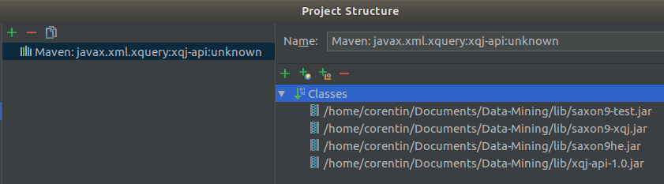

# TP Data Mining

# Configuration

Configuration des jar *saxon* et *xqj*.

# Tree TAGGER

Télécharger Tree TAGGER à l'adresse [suivante](http://www.cis.uni-muenchen.de/~schmid/tools/TreeTagger/).

